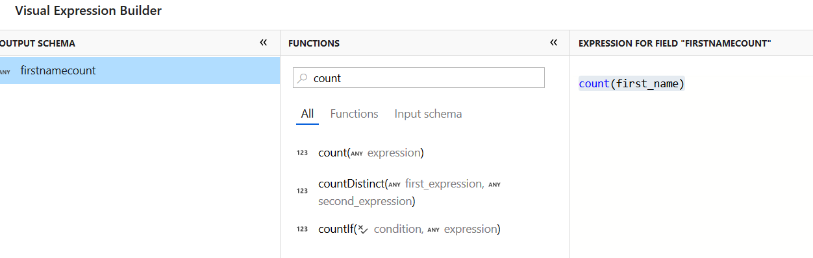

# Azure Data Factory - Mapping Data Flow
**Produced by Dave Lusty**

## Introduction

In this demo we will import some data in JSON format and then convert it to CSV before using data flows to transform it in Azure Data Factory.

# Instructions

## Create Storage Account
First, create a resource group called ADFDataFlow in your chosen region.

Next, create a new storage account called adfdataflow20190617 (use the current date, or something random to make this unique). Place it in your resource group, and in the same region. Don't forget to change the storage to LRS to reduce costs for the demo.

Next, open the storage account and browse to Blob. Here we need to create some containers for data. Create the following containers:

* sourcejson
* sourcecsv
* sinkconsolidated
* sinkaggr
* sinkfemale
* sinkother

## Data

I used [mockaroo.com](https://mockaroo.com/) to generate some data. You'll find this in the repository as a [zip file](DemoData.zip). You can choose to generate your own data here, or upload the files within the zip file to your sourcejson container. The data is in JSON format for this demo to show the process to change formats. You'll often need to link Data Flows and other Data Factory functionality, especially as data is ingested. I have named my files with sortable date stamps here as this is very common in real systems to allow for ingesting one day at a time. For this demo, this is unnecessary and we'll use manual triggers rather than tumbling windows.

Once the files are successfully uploaded, we're ready to work on the Data Factory transformations.

## Data Factory

Next, create a Data Factory and call it adfdataflow20190617 (replace the date with current date or something unique). Place it in the same resource group and region as above. Make sure you use V2 to get the Data Flow functionality.

First, we need to create a connection to the blob storage account. Open the Data Factory and click "Author and Monitor" to get to the ADF interface. Click the Author button (pencil on the left side menu). Now click connections at the bottom of the screen and choose "New". Select "Azure Blob Storage" then continue.

Use the default name of AzureBlobStorage1 and then select your subscription and storage account. Then click Finish.

Next, we need to create some datasets. This will be an iterative process here for simplicity. We'll create the json dataset along with an imported schema, then we'll create a csv version without schema. We then use a copy job to create CSV data which we'll use to generate the CSV schema. You can (and usually should!) create the CSV schema manually, but this is a handy shortcut when you want the same or a very similar schema.

Click the new button and select dataset. Choose Azure Blob Storage, and then JSON.

Name the dataset "sourcejson"

On the connection tab, select your linked service. Browse to the sourcejson container (here referred to as a folder). 

File format shoudl be JSON format, then for file pattern choose set of objects. Now click the Parse JSON Path button to fill in the columns. It's possible to edit the columns here using jsonpath format, and you can even add in custom derived columns at this stage. Not that this is not the schema, this is the definition of what to import. You can delete any unwanted columns to reduce the amount of data flowing through the system for optimisation purposes.

Now click the schema tab and import schema to get the column information.

Now create another dataset, this time using csv (delimited text) format and the sourcecsv container. Name this sourcecsv and link the same service as before. Tick the first row as header checkbox and select none for schema.

We don't need to change anything else at this stage, but we'll return later to set up the schema.

Next, create a pipeline and drag a copy data function to it. Under the source tab, select sourcejson as the dataset. Under sink choose sourcecsv. Change the file extension from .txt to .csv to match the format we've chosen.

Now click Publish all to save everything and push to the service. Once this is completed, click Add Trigger and choose Trigger Now. Click finish to start the job.

A few seconds later the job should complete and you will have 10 new files in the sourcecsv container (note: while writing this demo, the file extension change did not work so my files still have a .json extension - this does not affect the demo so please just carry on and ignore screenshots which look weird. Bug has been submitted).

Click back on to the sourcecsv tab and then schema. Click Import schema and choose "from files with *.*" since we only have our csv files in this container. I don't recommend relying on the extension to separate different files in a data lake, containers are free so use them.

You'll now see the schema imported, which we'll use later in the demo.

# Data Flows

Now click new and select data flow. Next choose Mapping Data Flow. Wrangling Data Flow is used for data preparation in data science type scenarios where real time data wrangling is the goal rather than industrialised data preparation for analytics. I'll create a demo on that functionality later.

Click finish and you'll be taken to the data flow designer.

Click Add source and select sourcecsv as the source dataset. Next, click the plus sign in the designer to add an action. Select sink from the list.

Click on New next to sink dataset to create a new dataset. You could also use an existing dataset since these are the same ones as in the data factory designer. Selct Azure Blob Storage, then delimited text. In production it's more likely that you'll use Parquet format for performance reasons, but here we want to be able to open the files to see the results immediately.
Name the dataset sinkconsolidated and choose your linked service. Select the sinkconsolidated container and no schema then click finish.

This will simply consolidate all 10 files into one new file. We generally aim for files of 250MB to 1GB so lots of small files should usually be consolidated in this way for processing. Once created, click on the settings tab and choose "output to single file" and give the file a name.

Next, click the plus again after source and select New Branch. This allows us to have multiple paths in our flow. Click the plus next to the new path and select aggregate. In Aggregate Settings under "group by" select first_name as source1's column.

Next, on the aggregates tab, type firstnamecount in the first box - this will cretae a column with the count of first names. Click Enter  expression and then find the count() function using the filter box. Select this and type first_name between the parenthesis. Alternatively you can just type `count(first_name)` in the editor then click save and finish.

Next, add a sink after the aggregate function. Create a new dataset called sinkaggr and select the container with the same name. Once created, click on the settings tab and choose "output to single file" and give the file a name.

Now create a third branch and add a conditional split function. Under stream names, add "Female" as the first, and "Other" as the default stream. Click the condition box next to femail and enter `gender=='Female'` in the editor. In this instance, gender is one of our columns and we're selecting any which match "Female".

Now create datasets and sinks for each of these two new streams, use the same settings as before including setting output to a single CSV file. Use the remaining containers sinkfemale and sinkother for these.

You should now have a flow that looks like the below.

Now, add a new pipeline and add a data flow action to it. Select the data flow you just created and then publich all.

Once publishing is complete, trigger a run manually. This will take some time to run as the jobs are submitted in the background. Once complete, you will be able to open the various files created in your blob storage and see the results. 

JSON code for all of the Azure Data Factory objects is available in the [JSON Code Folder](https://github.com/davedoesdemos/PreviewMappingDataFlow/tree/master/code) in the repository.